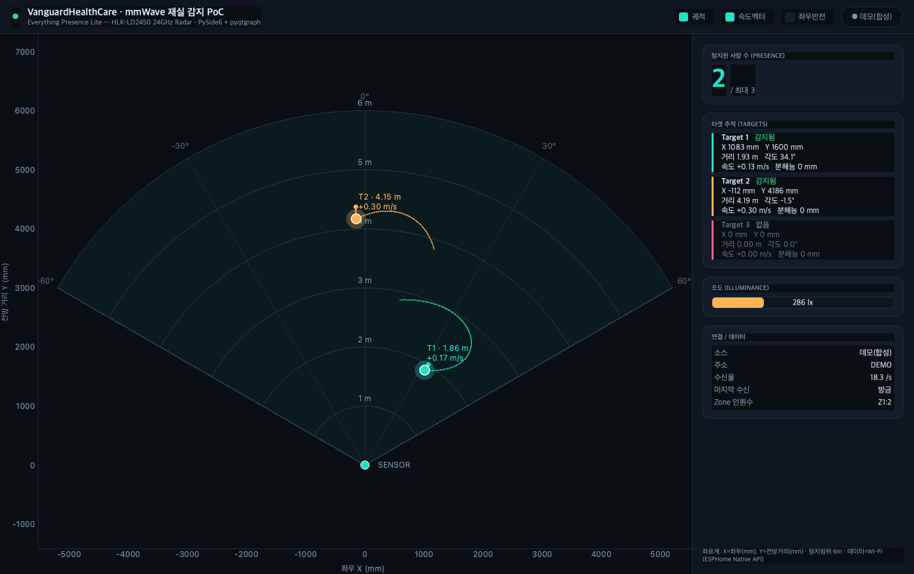

# VanguardHealthCare · mmWave **다중 센서** 재실·추적 PoC — Wi‑Fi 판

여러 대의 **Everything Presence Lite**(ESP32 + HLK‑LD2450 24GHz mmWave 레이더) 센서를 **Wi‑Fi 에 연결**하고,
각 센서의 좌표를 **하나의 방(room) 좌표계로 융합**해 사람의 **위치 · ID · 궤적**을 실시간 레이더 화면으로 추적합니다.
한 사람이 오래 머무르면 **장기 체류 경보**(낙상/이상 정황 감지의 기초)를 띄우는 헬스케어 PoC 입니다.

USB 케이블은 **최초 1회 Wi‑Fi 등록(프로비저닝)** 때만 쓰고, 평시에는 노트북과 **유선 연결 없이 무선으로** 동작합니다.

> USB 직결(단일 센서) 버전은 옆 폴더 `VanguardHealthCare_2PoC_mmWave` 를 참고하세요.
> 이 폴더는 **데이터 소스를 USB→Wi‑Fi 로 바꾸고**, 여러 센서를 **융합**하도록 확장한 버전입니다.



---

## 1. 전체 워크플로 (★ 순서 중요)

```
① 프로비저닝 (USB, 센서마다 1회)        ② 자동 포지셔닝 (캘리브레이션)
   센서 USB 연결 → ./run_provision.sh       센서를 실제 위치에 설치·전원만 연결
   → Wi-Fi SSID/PW 입력                      → 방을 한 사람이 걸어다니며
   → 센서 IP 가 epl_config.json 에 저장         ./run_auto_positioning.sh
        │                                    → 각 센서의 x,y·설치각이 계산되어
        │                                       epl_config.json 에 저장
        ▼                                            │
   (센서를 USB에서 분리, 콘센트 전원만)                 ▼
                                          ③ 무선 시각화 / 추적
                                             ./run_gui.sh (네이티브) 또는 ./run.sh (웹)
                                                     │
                                                     ▼
                                          ④ (선택) 하이퍼파라미터 최적화
                                             ./run_debug_gui.sh 로 원시 로그 기록
                                             → ./run_optimization.sh → best_params.yaml
```

1. **프로비저닝** — 센서를 노트북에 USB로 연결하고 `./run_provision.sh` → Wi‑Fi 선택·비밀번호 입력.
   성공하면 센서가 `epl_config.json` 에 등록됩니다. **센서마다 1회씩** 반복합니다.
2. **자동 포지셔닝(외부 캘리브레이션)** — 센서들을 방의 실제 위치에 설치한 뒤, 한 사람이 겹침 구역을 포함해
   걸어다니면 `./run_auto_positioning.sh` 가 각 센서의 **위치(x,y)와 설치각(yaw/pitch/roll/flip)** 을 자동 추정해
   저장합니다. 이 값으로 여러 센서가 **같은 좌표계**에서 겹쳐 그려집니다.
3. **무선 시각화·추적** — `./run_gui.sh`(권장) 또는 `./run.sh`(웹) 로 실행하면, 등록된 센서들의 데이터를 무선으로
   받아 **융합·추적**해 화면에 그립니다.
4. **(선택) 최적화** — ID 스위칭/오탐을 줄이려면 `./run_debug_gui.sh` 로 원시 로그를 기록하고
   `./run_optimization.sh` 로 하이퍼파라미터를 튜닝합니다. 결과(`best_params.yaml`)를 `./run_gui.sh` 가 자동 반영합니다.

---

## 2. 어떻게 동작하나 (데이터 경로 · 융합 파이프라인)

```
[1회: 프로비저닝]  노트북 --USB(Improv Serial)--> [ESP32]     : Wi-Fi 자격증명 전달

[평시: 무선 융합·추적]
  [LD2450]×N --UART--> [ESP32/ESPHome]×N --Wi-Fi(Native API :6053)-->
     [노트북] → mmwave_wifi_reader → SensorHub(센서별 상태)
            → 방 좌표 변환(외부보정: x,y·yaw·pitch·roll·flip)
            → dets(융합 입력 점들)
            → FusionTracker(스무딩·노이즈억제·매칭/게이트·확정큐·ReID·수명)
            → 사람별 ID·위치·궤적  →  [GUI / 웹 / CLI 시각화]
```

- **프로비저닝(USB)**: ESPHome 의 `improv_serial` 에 **Improv Wi‑Fi Serial 프로토콜**로 SSID/비밀번호를 전송합니다.
  바이트 포맷은 improv‑wifi/ESPHome 원본과 1:1 대조해 검증했습니다. (`improv_serial.py`)
- **무선 데이터(평시)**: EPL 기본 펌웨어는 **ESPHome Native API(TCP 6053)** 가 항상 켜져 있고 암호화 키도 없어,
  `aioesphomeapi` 로 바로 접속해 각 센서의 타겟 상태를 구독합니다. Home Assistant 불필요. (`mmwave_wifi_reader.py`)
  - 펌웨어에 `web_server` 가 켜져 있으면 `--transport web`(SSE)도 폴백으로 사용 가능(EPL 기본값은 꺼짐).
- **융합·추적**: 여러 센서의 검출점을 방 좌표로 옮겨 하나의 스트림(`dets`)으로 합친 뒤, `FusionTracker`(`fusion.py`)
  가 median 스무딩 · 유령/노이즈 억제 · 트랙 매칭/게이트 · 확정 큐 · **재식별(ReID)** · 트랙 수명 관리를 거쳐
  사람별 **안정적인 ID** 를 붙입니다. 튜닝 노브(≈30개)의 의미와 ↑↓ 효과는 **`run_gui.sh` 상단의 표**에 정리돼 있습니다.

### 좌표계 (방 좌표계 + 센서 오버레이)

| 항목 | 의미 |
|------|------|
| 방 원점 | 기준 센서(보통 Sensor 1) 위치, mm |
| **X / Y** | 방 좌표계의 좌우 / 전후 (mm) |
| 센서 배치 | 각 센서의 `x,y`(위치) + `heading_deg`(Yaw) · `pitch_deg` · `roll_deg` · `flip` 로 방 좌표계에 정렬 |
| 하드웨어 고정 | 센서당 시야각(FOV) 약 120°(±60°), 유효거리 약 6m, **LD2450 1대당 동시 3명** |
| 다중 센서 | 여러 센서를 겹쳐 **넓은 공간/사각지대**를 커버하고, 겹침 구역에서 같은 사람을 하나로 병합 |

---

## 3. 설치 & 실행

최초 실행 시 각 `run_*.sh` 가 `.venv` 와 필요한 의존성을 자동 설치합니다. (Python 3.10+ 권장)

### ① Wi‑Fi 등록 — USB 연결 상태에서, 센서마다 1회

```bash
cd /Users/pia/Desktop/RAK/Code/VanguardHealthCare_2PoC_mmWave_wifi
./run_provision.sh                          # 대화형: 포트 자동탐지 → AP 스캔 → 선택 → PW 입력
./run_provision.sh --ssid "RAK" --password "********"   # 비대화형
./run_provision.sh --scan                   # 주변 Wi-Fi 목록만
./run_provision.sh --probe                  # Improv 지원 여부만 확인(읽기전용)
```

### ② 자동 포지셔닝(캘리브레이션) — 센서 설치 후 1회

```bash
./run_auto_positioning.sh                   # 방을 한 사람이 걸어다니면 배치를 측정·저장(기본 120초)
./run_auto_positioning.sh --dry-run         # 계산만(저장 안 함)
./run_auto_positioning.sh --selftest        # 합성 데이터로 알고리즘 검증(하드웨어 불필요)

# 이미 기록해 둔 로그 여러 개로 배치를 추정(라이브 측정 대신, 더 안정적):
./run_auto_positioning_v2.sh
```
> ★ 측정 중에는 방에 **한 사람만** 있어야 하고, 두 센서가 **함께 보는 겹침 구역**을 곡선으로 지나가야
> 센서 간 상대 배치가 풀립니다.

### ③ 무선 시각화·추적 — USB 분리 후

```bash
./run_gui.sh                          # 네이티브 GUI (PySide6 + pyqtgraph, 권장·고성능)
./run.sh                              # 웹 대시보드 → http://127.0.0.1:8000/
./.venv/bin/python cli_monitor.py     # 터미널 모니터(빠른 확인)

# 주소 직접 지정 / 폴백 / 데모
./run_gui.sh --host 192.168.1.42            # 특정 센서만
./run.sh --transport web                    # web_server SSE 폴백
./run_gui.sh --demo                         # 하드웨어 없이 합성 데이터
./run_gui.sh --dwell-alert-sec 600          # 장기 체류 경보 임계(초). 0=끔, 기본 300(5분)
```
튜닝값은 `run_gui.sh`/`run.sh` 상단의 **설정 블록**에서 바꾸며, CLI 인자가 있으면 그게 우선합니다.

### ④ (선택) 하이퍼파라미터 최적화

```bash
./run_debug_gui.sh                          # 융합 전/후를 함께 표시 + 원시점을 debug_logs/ 에 JSONL 기록
./run_optimization.sh                       # 기록한 단일-인물 로그들로 다중-인물 GT 를 만들어 HP 튜닝
                                            #  → debug_logs/best_params.yaml (run_gui.sh 가 자동 반영)
                                            #  → debug_logs/analysis/ 에 상관분석 + 전/후 비교 영상
```

---

## 4. 설정 파일 — `epl_config.json`

프로비저닝과 자동 포지셔닝이 이 파일을 생성/갱신하고, 모든 시각화 도구가 이 파일을 읽어 무선 접속합니다.
Wi‑Fi **비밀번호는 저장되지 않습니다**(프로비저닝 시 센서로 직접 전송).

```jsonc
{
  "ssid": "RAK",              // 등록한 Wi-Fi(참고용)
  "discovery": true,          // mDNS(<node>.local) 자동 재연결
  "sensors": [
    {
      "id": "pia-1-1",                                       // ★ {organization}-{cameraId}-{sensorId}
      "mac": "A4:F0:0F:98:BD:80",                            // 물리 센서 대조용(코드는 안 읽음)
      "host": "10.201.31.120",                               // 접속 주소(고정 IP 권장)
      "node_name": "everything-presence-lite-98bd80",
      "name": "Sensor 1", "color": "#27e0c8",                // 화면 표시 이름·색
      "x": 0.0, "y": 0.0,                                    // 방 좌표계 위치(mm) — 자동 포지셔닝이 채움
      "heading_deg": 0.0, "pitch_deg": 0.0, "roll_deg": 0.0, // 설치각(Yaw/Pitch/Roll)
      "flip": false,                                         // 좌우반전(거울 장착 보정)
      "api_password": "", "noise_psk": null                  // HA 입양 등으로 키가 생겼을 때만 사용
    }
    // … 센서 추가 …
  ]
}
```

### 센서 id 규격 — 카메라 귀속

```
id = "{organization}-{cameraId}-{sensorId}"        예: "pia-1-1"
```

같은 `cameraId` 파트를 쓰는 센서들이 **한 카메라(=제품의 스트림 하나)** 에 묶인다.
제품(Product-AI-mono)의 알람은 카메라 단위로 발화하고 MQ 봉투의 `cameraId` 는 백엔드
등록값을 그대로 싣기 때문에, 이 파일은 "그 카메라에 어떤 센서가 묶이는가" 만 답한다.

| 규칙 | 내용 |
|---|---|
| 파싱 | `split("-", 2)` 3파트. `organization`/`cameraId` 파트에는 `-` 불가, `sensorId` 파트에는 허용(예: `pia-1-10-201-31-120`) |
| 비교 | 세 파트 모두 불투명 문자열(숫자로 파싱하지 않음). 대조는 `normalize_id_value`(`strip().lower()`) **단일 기준** — 대소문자만 다른 id 는 **같은 id 로 보고 중복 처리**한다. 숫자 정규화는 없으므로 `"01"` 과 `"1"` 은 **다른** cameraId·sensorId 다 |
| `sensorId` | 생략하면 그 카메라에서 **아직 안 쓰인 최소 순번**이 결정적으로 배정된다(기기 유래 `spec_key` 정렬 — 배열 순서와 무관). **명시한 id 는 절대 재번호화하지 않는다.** 비숫자(`north`)·비연속·역순도 정상 동작하며, 순번은 관례일 뿐 기능적 순서가 아니다. 대신 어느 물리 센서인지는 `mac` 으로만 알 수 있다 |
| 실패 | id 형식 위반·`id` 누락·id 중복·같은 host 중복·옛 `rooms` 스키마 → 제품이 **스트림 등록을 거절**한다 |

- 카메라를 정하거나 바꾸려면 `./run_provision.sh` 의 `CAMERA_ID`(또는 `--camera-id`)를
  쓴다. **이때 센서 id 자체가 다시 쓰인다** — id 는 융합 입력의 `sid` 이자 기록
  JSONL 의 센서 식별자라, 바꾸면 **이전 녹화와 대조가 끊긴다**(스크립트가 경고한다).
- `x`/`y`/`heading_deg` 는 **방 좌표계** 값이고 카메라마다 별도의 방 좌표계다 →
  카메라마다 `./run_auto_positioning_v2.sh --camera-id <id>` 를 따로 돌려야 한다.
- ★ 현장 설치 시 `cameraId` 파트를 **병원이 부여한 실제 cameraId** 로 교체해야 한다.
  숫자일 필요는 없다 — 제품의 `AddStreamModel.cameraId` 는 **문자열**이고, 백엔드가 JSON
  숫자로 보내도 DTO 경계에서 문자열로 승격된다. 교체하지 않으면 기본값 `1` 이 현장
  카메라와 안 맞아 그 스트림은 센서 0개가 된다(= 체류 알람이 아예 안 나감).
  단 `cameraId` 에 `_` 는 쓸 수 없다 — 제품 `stream_id` 가 `{cameraId}_{organization}` 이라
  경계가 모호해진다(`-` 는 센서 id 구분자라 역시 금지).

---

## 5. 문제 해결

```bash
./.venv/bin/python check_sensors.py         # 등록된 센서들의 Native API(6053) 도달성 빠른 점검
./.venv/bin/python diagnose.py              # 무선 연결 상세 진단(다중 센서)
```

| 증상 | 해결 |
|------|------|
| 프로비저닝 시 포트 못 찾음 | USB 케이블/드라이버 확인, `--port` 로 직접 지정, 다른 프로그램의 포트 점유 해제 |
| `UNABLE_TO_CONNECT` | Wi‑Fi SSID/PW·신호세기 확인, **2.4GHz** 인지 확인(ESP32 는 5GHz 미지원) |
| 시각화가 데모로 뜸 | `epl_config.json` 에 센서 없음 → 프로비저닝부터, 또는 `--host` 로 IP 지정 |
| 센서에 도달 못함 | 노트북·센서가 **같은 Wi‑Fi/서브넷**인지, 공유기 **AP isolation(단말 격리)** 해제, DHCP 로 IP 바뀜 여부 확인 |
| 센서가 겹치지 않음/배치 이상 | 자동 포지셔닝 재실행, 측정 중 **겹침 구역을 곡선으로** 이동했는지 확인, `--ref` 로 기준 센서 지정 |
| ID 가 자꾸 바뀜/유령 | `run_gui.sh` 상단 표 참고(STRIDE↑·ASSIGN=hungarian·RECENT_FRAMES↑ 등) 또는 `./run_optimization.sh` |
| API 암호화 키 필요 | HA 에 입양돼 키가 생긴 경우 → `--noise-psk <키>` 또는 `epl_config.json` 의 `noise_psk` 설정 |

---

## 6. 파일 구조

```
VanguardHealthCare_2PoC_mmWave_wifi/
├─ ① 프로비저닝(USB 1회)
│  ├─ improv_serial.py        # Improv Wi-Fi Serial 프로토콜(호스트 구현) — 바이트 검증 완료
│  ├─ provision_wifi.py       # Wi-Fi 등록 CLI (스캔/프로비저닝/probe)
│  └─ run_provision.sh        #  └ 실행기  ← "센서를 Wi-Fi에 연결"
│
├─ ② 자동 포지셔닝(캘리브레이션)
│  ├─ auto_positioning.py     # 라이브(걸어다니며 1회 측정)로 센서 배치 추정
│  ├─ auto_positioning_multi.py  # 여러 debug 로그를 풀링해 배치 추정(v2, 더 안정적)
│  ├─ run_auto_positioning.sh / run_auto_positioning_v2.sh
│  └─ epl_config.py / epl_config.json  # 센서 목록·주소·배치(x,y·yaw/pitch/roll/flip) 저장
│
├─ 데이터 수신 · 융합(공통 코어)
│  ├─ mmwave_wifi_reader.py   # 무선 리더: Native API(기본) + web SSE(폴백) → SensorState
│  ├─ mmwave_reader.py        # SensorState/SensorHub/Target/DemoThread (상태 모델)
│  ├─ mmwave_parser.py        # ESPHome 로그/상태 → 타겟 좌표 파싱(순수 함수)
│  └─ fusion.py               # ★ FusionTracker — 다중 센서 융합 + ID 추적(파라미터 SSOT)
│
├─ ③ 시각화(무선)
│  ├─ gui_qt.py / run_gui.sh          # 네이티브 GUI (PySide6 + pyqtgraph) ← 권장
│  ├─ server.py / index.html / run.sh # 웹 대시보드 (HTTP + SSE)
│  ├─ run_debug_gui.sh                # 디버그 GUI: 융합 전/후 표시 + 원시 JSONL 기록
│  └─ cli_monitor.py                  # 터미널 모니터(빠른 확인)
│
├─ ④ 최적화(HPO)
│  ├─ optimize_fusion.py / run_optimization.sh  # 다중-인물 GT 로 HP 튜닝 → best_params.yaml
│  ├─ merge_gt.py             # 단일-인물 로그 N개 → 다중-인물 GT 합성
│  └─ replay_video.py         # 최적화 전/후 좌우 비교 MP4 생성
│
├─ 진단 / 요구사항
│  ├─ check_sensors.py        # 센서 통신 빠른 점검(6053)
│  ├─ diagnose.py             # 무선 도달성 상세 진단
│  ├─ requirements.txt        # pyserial, aioesphomeapi, zeroconf
│  └─ requirements-gui.txt    # PySide6, pyqtgraph, numpy (GUI 전용)
│
└─ debug_logs/               # 원시 기록·최적화 산출물(재생성 가능·대용량) — best_params.yaml 포함
```

---

## 7. 한계 / 참고

- **2.4GHz 전용**: ESP32 는 5GHz Wi‑Fi 를 지원하지 않습니다. 2.4GHz SSID 로 등록하세요.
- **센서당 3명**: LD2450 1대는 동시 3명까지 추적합니다. 다중 센서 융합으로 공간은 넓히되, 한 지점에 몰린 인원수는
  각 센서 한계의 영향을 받습니다.
- **갱신율**: Native API 수신은 안정적이지만 LD2450 원본은 ~10Hz 이고, 화면/융합은 `FUSE_HZ`(기본 15Hz) 기준으로
  처리·보간합니다.
- **캘리브레이션 품질**이 융합 정확도를 좌우합니다. 배치가 이상하면 겹침 구역을 충분히 걸어 자동 포지셔닝을 다시 하세요.
- **오프라인 최적화의 유효성**: `run_debug_gui.sh` 로 남긴 원시 로그는 라이브와 100% 동일하게 replay 되므로,
  `run_optimization.sh` 로 찾은 파라미터가 실사용에 그대로 적용됩니다.
- 낙상 판정·존(zone) 알림 등 헬스케어 로직은 이 추적 결과 위에 얹을 수 있습니다.
```
